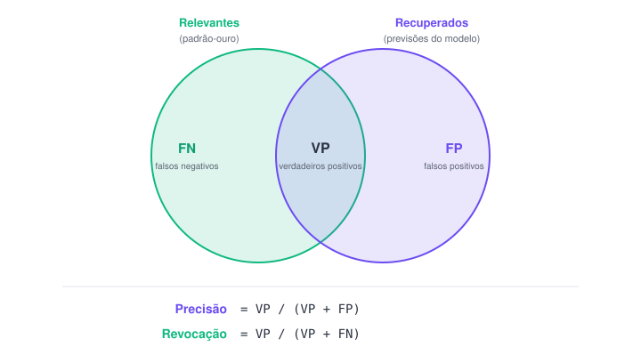

### Objetivos de aprendizagem

Ao final desta unidade, você deverá:

- entender o que é um **padrão‑ouro** (*gold standard*);
- saber **avaliar a concordância** entre anotadores humanos;
- compreender **métricas simples** para avaliar o desempenho do processamento de linguagem natural.

---

## 1. O que é um padrão‑ouro (*gold standard*)?

Um **padrão‑ouro** (*gold standard*) — também chamado de *ground truth* ("verdade fundamental") — refere‑se a **dados verificados por humanos** que podem ser usados como referência (*benchmark*) para avaliar o desempenho de algoritmos. Em processamento de linguagem natural, os padrões‑ouro medem quão bem os **humanos** desempenham uma tarefa.

O objetivo do PLN é permitir que computadores **alcancem ou superem** o desempenho humano em uma tarefa pré‑definida. Medir se os algoritmos conseguem isso exige uma referência — e é o padrão‑ouro que a fornece. Em termos simples, ele oferece um **ponto de referência**.

É importante entender, porém, que **padrões‑ouro são abstrações do uso da língua**. Considere a tarefa de classificar palavras em classes gramaticais: as classes não são dadas pela natureza — elas representam uma abstração que impõe estrutura à língua. A língua, entretanto, é naturalmente **ambígua e subjetiva**, e as abstrações usadas podem ser incompletas: não temos certeza de que todos os usuários classificariam as palavras da mesma forma.

Por isso precisamos **medir a confiabilidade** de qualquer padrão‑ouro, ou seja, até que ponto os humanos **concordam** na tarefa.

---

## 2. Medindo a confiabilidade manualmente

Esta seção mostra como a **confiabilidade** — geralmente entendida como a **concordância entre múltiplos anotadores** — pode ser medida manualmente.

### Passo 1 — Anotar os dados

A **análise de sentimento** é uma tarefa que consiste em determinar o sentimento de um texto. Treinar um modelo de análise de sentimento exige coletar dados de treino, isto é, exemplos de textos associados a diferentes sentimentos.

Classifique os *tweets* a seguir em três categorias — **positivo**, **neutro** ou **negativo** — de acordo com o sentimento. Anote sua decisão (uma por linha), mas **não** discuta nem mostre ao colega ao lado:

1. Updated: HSL GTFS (Helsinki, Finland) https://t.co/fWEpzmNQLz
2. current weather in Helsinki: broken clouds, -8°C 100% humidity, wind 4kmh, pressure 1061mb
3. CNN: "WallStreetBets Redditors go ballistic over GameStop's sinking share price"
4. Baana bicycle counter. Today: 3 Same time last week: 1058 Trend: ↓99% This year: 819 518 Last year: 802 079 #Helsinki #cycling
5. Elon Musk is now tweeting about #bitcoin
6. A perfect Sunday walk in the woods just a few steps from home.
7. Went to Domino's today👍 It was so amazing and I think I got damn good dessert as well…
8. Choo Choo 🚂 There's our train! 🎉 #holidayahead
9. Happy women's day ❤️💋 kisses to all you beautiful ladies. 😚 #awesometobeawoman
10. Good morning #Helsinki! Sun will rise in 30 minutes (local time 07:28)

Anote suas classificações (uma por linha, de 1 a 10). O colega ao lado faz o mesmo, de forma independente — assim teremos **dois anotadores** para comparar.

### Passo 2 — Calcular a concordância percentual

Ao criar conjuntos de dados para treinar modelos, geralmente queremos que os dados sejam **confiáveis**, ou seja, que haja concordância sobre o que descrevemos (aqui, o sentimento dos *tweets*).

Uma forma de medir isso é a **concordância percentual** simples: quantas vezes, das 10, você e o colega concordaram. Basta dividir o número de concordâncias pelo número de itens (10):

```python
# Substitua o numero abaixo pelo numero de itens em que voces concordaram
agreement = 0

# Divide a contagem pelo numero de tweets
agreement = agreement / 10

# Imprime a variavel
agreement
```

```text
0.0
```

### Passo 3 — Calcular as probabilidades de cada categoria

A concordância percentual é, na verdade, uma medida **muito ruim**: qualquer um dos dois pode ter **acertado por sorte** — ou ter achado a tarefa tediosa e classificado tudo aleatoriamente. Se isso aconteceu, a concordância percentual **não tem como detectar**, pois ela não distingue acerto real de acaso!

Felizmente, dá para estimar a possibilidade de **concordância por acaso**. O primeiro passo é contar quantas vezes **você** usou cada categoria e converter essas contagens em **probabilidades**, dividindo pelo total de *tweets*:

```python
# Conte quantos itens *voce* colocou em cada categoria
positive = 0
neutral = 0
negative = 0

# Converte as contagens em probabilidades
positive = positive / 10
neutral = neutral / 10
negative = negative / 10

# Chama cada variavel para examinar a saida
positive, neutral, negative
```

```text
(0.0, 0.0, 0.0)
```

Essas probabilidades representam a chance de **você** escolher aquela categoria. Agora pergunte ao colega as probabilidades dele e registre‑as:

```python
nb_positive = 0
nb_neutral = 0
nb_negative = 0
```

Conhecendo as probabilidades de cada classe para os **dois** anotadores, podemos calcular a probabilidade de ambos escolherem a mesma categoria **por acaso**. Para cada categoria, basta multiplicar a sua probabilidade pela do colega:

```python
both_positive = positive * nb_positive
both_neutral = neutral * nb_neutral
both_negative = negative * nb_negative
```

::: nota
**Nota:** se um anotador não colocou nenhum *tweet* em uma categoria (por exemplo, `negative`) e o outro colocou, isso **anula** a chance de concordância por acaso naquela categoria — multiplicar por zero resulta em zero.
:::

### Passo 4 — Estimar a concordância esperada (por acaso)

Agora podemos calcular quão provável é concordar **por acaso**. Isso é a **concordância esperada** (*expected agreement*), obtida somando as probabilidades combinadas de cada categoria:

```python
expected_agreement = both_positive + both_neutral + both_negative

expected_agreement
```

```text
0.0
```

Conhecendo tanto a **concordância observada** (`agreement`) quanto a **esperada por acaso** (`expected_agreement`), podemos usar uma medida mais confiável: o **kappa de Cohen** (κ), que estima a concordância a partir de ambas. A fórmula é:

$$\kappa = \frac{P_{observado} - P_{esperado}}{1 - P_{esperado}}$$

Como essa informação já está nas variáveis `agreement` e `expected_agreement`, calculamos κ facilmente. Note que envolvemos as subtrações em **parênteses** para executá‑las antes da divisão:

```python
kappa = (agreement - expected_agreement) / (1 - expected_agreement)

kappa
```

```text
0.0
```

---

## 3. O kappa de Cohen como medida de concordância

O valor teórico do κ de Cohen vai de **−1** (discordância perfeita) a **+1** (concordância perfeita), com **0** indicando concordância totalmente aleatória. O κ costuma ser interpretado como uma medida da **força** da concordância.

Landis e Koch (1977) propuseram os *benchmarks* abaixo — que devem ser levados **com cautela**, pois as divisões são arbitrárias:

| Kappa de Cohen (κ) | Força da concordância |
|:---|:---|
| < 0,00 | Pobre |
| 0,00 – 0,20 | Ligeira |
| 0,21 – 0,40 | Razoável |
| 0,41 – 0,60 | Moderada |
| 0,61 – 0,80 | Substancial |
| 0,81 – 1,00 | Quase perfeita |

O κ de Cohen serve para medir a concordância entre **dois** anotadores, e as categorias disponíveis devem ser fixadas de antemão. Para mais de dois anotadores, usa‑se uma medida como o **κ de Fleiss**.

Na prática, o κ de Cohen (e muitas outras medidas) já está implementado em bibliotecas Python — raramente é preciso calcular à mão. A biblioteca **scikit‑learn** (`sklearn`), por exemplo, inclui a função `cohen_kappa_score()`, que recebe **duas listas** e calcula o κ entre elas:

```python
# Importa a funcao cohen_kappa_score do modulo 'metrics' da scikit-learn
from sklearn.metrics import cohen_kappa_score

# Define duas listas, 'a1' e 'a2', com anotacoes de classes gramaticais
a1 = ['ADJ', 'AUX', 'NOUN', 'VERB', 'VERB']
a2 = ['ADJ', 'VERB', 'NOUN', 'NOUN', 'VERB']

# Usa cohen_kappa_score() para calcular a concordancia entre as listas
cohen_kappa_score(a1, a2)
```

```text
0.44444444444444453
```

Segundo o *benchmark* de Landis e Koch, esse valor indicaria concordância **moderada**.

::: dica
**Dica:** raramente é preciso anotar o conjunto inteiro para medir a concordância — uma **amostra aleatória** costuma bastar. Se o κ sugere que os anotadores concordam, assumimos que as anotações são confiáveis (não aleatórias). Ainda assim, toda medida de concordância entre anotadores depende de suas próprias suposições sobre o que é "concordar" — nenhuma representa a verdade absoluta.
:::

---

## 4. Avaliando o desempenho de modelos de linguagem

Com um padrão‑ouro suficientemente confiável, podemos usá‑lo para medir o desempenho de modelos de linguagem. Suponha um padrão‑ouro com 10 tokens anotados por classe gramatical, na lista `gold_standard`, e as previsões de um modelo na lista `predictions`:

```python
# Define a lista 'gold_standard' (padrao-ouro anotado por humanos)
gold_standard = ['ADJ', 'ADJ', 'AUX', 'VERB', 'AUX', 'NOUN', 'NOUN', 'ADJ', 'DET', 'PRON']

# Define a lista 'predictions' (previsoes do modelo de linguagem)
predictions = ['NOUN', 'ADJ', 'AUX', 'VERB', 'AUX', 'NOUN', 'VERB', 'ADJ', 'DET', 'PROPN']
```

### 4.1 Acurácia

Vamos importar o módulo `metrics` inteiro da scikit‑learn. A função `accuracy_score()` calcula a **acurácia**, que é exatamente a mesma coisa que a concordância observada calculada manualmente:

```python
# Importa o modulo 'metrics' da biblioteca scikit-learn (sklearn)
from sklearn import metrics

# Usa a funcao accuracy_score() do modulo 'metrics'
metrics.accuracy_score(gold_standard, predictions)
```

```text
0.7
```

A acurácia sofre do mesmo problema da concordância observada — pode ser resultado de **palpites de sorte**. Como é um exemplo pequeno, dá para verificar que **7 de 10** classes gramaticais coincidem, resultando em acurácia de 0,7 (70%).

### 4.2 Matriz de confusão

Para avaliar melhor o modelo, organizamos os resultados em uma **matriz de confusão**. Precisamos de todas as classes gramaticais que aparecem em `gold_standard` e `predictions`. Coletamos as categorias únicas com a função `set()` — um **conjunto** (*set*) é uma estrutura do Python com itens únicos, útil aqui para remover duplicatas:

```python
# Coleta as classes gramaticais unicas em um conjunto, combinando as duas listas
pos_tags = set(gold_standard + predictions)

# Ordena o conjunto alfabeticamente e converte o resultado em lista
pos_tags = list(sorted(pos_tags))

# Imprime a lista resultante
pos_tags
```

```text
['ADJ', 'AUX', 'DET', 'NOUN', 'PRON', 'PROPN', 'VERB']
```

Usamos essas categorias para montar uma tabela em que as **linhas** representam o padrão‑ouro e as **colunas** as previsões do modelo. Percorremos cada par de itens (padrão‑ouro, previsão) e somamos `+1` na célula correspondente. Por exemplo, o primeiro item de `gold_standard` é `ADJ` e o primeiro de `predictions` é `NOUN`:

```python
# Imprime o primeiro item de cada lista
gold_standard[0], predictions[0]
```

```text
('ADJ', 'NOUN')
```

Encontramos a linha `ADJ` e a coluna `NOUN` e somamos 1 àquela célula. A tabela completa (a **matriz de confusão**) fica assim:

|  | ADJ | AUX | DET | NOUN | PRON | PROPN | VERB |
|:--|:-:|:-:|:-:|:-:|:-:|:-:|:-:|
| **ADJ**  | 2 | 0 | 0 | 1 | 0 | 0 | 0 |
| **AUX**  | 0 | 2 | 0 | 0 | 0 | 0 | 0 |
| **DET**  | 0 | 0 | 1 | 0 | 0 | 0 | 0 |
| **NOUN** | 0 | 0 | 0 | 1 | 0 | 0 | 1 |
| **PRON** | 0 | 0 | 0 | 0 | 0 | 1 | 0 |
| **PROPN**| 0 | 0 | 0 | 0 | 0 | 0 | 0 |
| **VERB** | 0 | 0 | 0 | 0 | 0 | 0 | 1 |

As previsões corretas formam uma **linha aproximadamente diagonal** na tabela. A partir dela, derivamos duas métricas por classe: **precisão** (*precision*) e **revocação** (*recall*).



- **Precisão** é a proporção de previsões corretas **por classe** — quantas das previsões daquela classe estavam certas. Por exemplo, a coluna `VERB` soma `2`, mas só `1` previsão está correta (na linha `VERB`); logo, a precisão de `VERB` é 1/2 = **0,5**. O mesmo vale para `NOUN`.
- **Revocação** é a proporção de previsões corretas dentre **todos os exemplos reais** daquela classe — quantas instâncias reais o modelo conseguiu "encontrar". Por exemplo, a linha `ADJ` soma `3` (há três adjetivos no padrão‑ouro), mas só `2` estão na coluna `ADJ`; logo, a revocação de `ADJ` é 2/3 ≈ **0,66**. Para `NOUN`, a revocação é 1/2 = 0,5.

A scikit‑learn gera matrizes de confusão automaticamente com `confusion_matrix()`:

```python
# Calcula a matriz de confusao para as duas listas e imprime o resultado
print(metrics.confusion_matrix(gold_standard, predictions))
```

```text
[[2 0 0 1 0 0 0]
 [0 2 0 0 0 0 0]
 [0 0 1 0 0 0 0]
 [0 0 0 1 0 0 1]
 [0 0 0 0 0 1 0]
 [0 0 0 0 0 0 0]
 [0 0 0 0 0 0 1]]
```

### 4.3 Precisão e revocação com a scikit‑learn

A **precisão** é implementada na função `precision_score()`. Como temos **mais de duas** classes, precisamos definir como os resultados de cada classe são combinados, pelo argumento `average`. Com `average=None`, a função calcula a precisão **de cada classe**. Também definimos `zero_division=0` para evitar erro quando uma classe de `predictions` não existe em `gold_standard` (nesses casos, a precisão é 0):

```python
# Calcula a precisao entre as duas listas, para cada classe (classe gramatical)
precision = metrics.precision_score(gold_standard, predictions, average=None, zero_division=0)

# Chama a variavel para examinar o resultado
precision
```

```text
array([1. , 1. , 1. , 0.5, 0. , 0. , 0.5])
```

A saída é um **array NumPy**. Para combinar os rótulos de `pos_tags` com as pontuações de `precision`, usamos a função `zip()`, que une listas/arrays do mesmo tamanho; para visualizar, convertemos com `dict()`:

```python
# Combina o conjunto 'pos_tags' com o array 'precision' usando zip();
# converte o resultado em um dicionario
dict(zip(pos_tags, precision))
```

```text
{'ADJ': 1.0, 'AUX': 1.0, 'DET': 1.0, 'NOUN': 0.5, 'PRON': 0.0, 'PROPN': 0.0, 'VERB': 0.5}
```

Para uma **única** pontuação de precisão para todas as classes, usamos `average='macro'`, que trata cada classe como igualmente importante, independentemente de quantas instâncias ela tem:

```python
# Calcula a precisao entre as duas listas e tira a media (macro)
macro_precision = metrics.precision_score(gold_standard, predictions, average='macro', zero_division=0)

# Chama a variavel para examinar o resultado
macro_precision
```

```text
0.5714285714285714
```

A precisão **macro** é a soma das precisões dividida pelo número de classes — dá para verificar manualmente:

```python
# Calcula a media macro manualmente: soma as precisoes e divide
# pelo numero de classes em 'precision'
sum(precision) / len(precision)
```

```text
0.5714285714285714
```

A **revocação** é calculada do mesmo modo, com `recall_score()`:

```python
# Calcula a revocacao entre as duas listas, para cada classe
recall = metrics.recall_score(gold_standard, predictions, average=None, zero_division=0)

# Combina 'pos_tags' com o array 'recall' e converte em dicionario
dict(zip(pos_tags, recall))
```

```text
{'ADJ': 0.6666666666666666, 'AUX': 1.0, 'DET': 1.0, 'NOUN': 0.5, 'PRON': 0.0, 'PROPN': 0.0, 'VERB': 1.0}
```

### 4.4 Relatório de classificação

A scikit‑learn oferece a função `classification_report()`, que dá precisão e revocação de cada classe, junto com o **F1‑score** — uma média equilibrada entre precisão e revocação (ambas contribuem igualmente), variando de 0 a 1:

```python
# Imprime um relatorio de classificacao
print(metrics.classification_report(gold_standard, predictions, zero_division=0))
```

```text
              precision    recall  f1-score   support

         ADJ       1.00      0.67      0.80         3
         AUX       1.00      1.00      1.00         2
         DET       1.00      1.00      1.00         1
        NOUN       0.50      0.50      0.50         2
        PRON       0.00      0.00      0.00         1
       PROPN       0.00      0.00      0.00         0
        VERB       0.50      1.00      0.67         1

    accuracy                           0.70        10
   macro avg       0.57      0.60      0.57        10
weighted avg       0.75      0.70      0.71        10
```

As pontuações da linha `macro avg` correspondem às que calculamos acima. A linha `weighted avg` (média **ponderada**) leva em conta o número de instâncias de cada classe; a coluna `support` conta quantas instâncias foram observadas em cada classe.

---

## Quiz

Marque a alternativa correta (a resposta certa está destacada com ✅).

**1. Um padrão‑ouro (*gold standard*) é:**

1. Dados verificados por humanos, usados como referência ✅
2. A saída bruta do modelo
3. Um dicionário do Python

**2. Por que a concordância percentual é uma medida fraca?**

1. Não distingue acerto real de acerto por acaso ✅
2. É difícil de calcular
3. Só funciona com duas classes

**3. O kappa de Cohen mede a concordância entre quantos anotadores?**

1. Dois ✅
2. Três
3. Qualquer número

**4. A precisão de uma classe responde: das vezes em que o modelo *previu* essa classe,**

1. quantas estavam certas ✅
2. quantas existiam no total
3. quantas ele deixou de encontrar

**5. A revocação de uma classe responde: dos exemplos que *realmente* são dessa classe,**

1. quantos o modelo encontrou ✅
2. quantos ele previu a mais
3. quantos estavam errados

**6. O F1‑score é:**

1. A média equilibrada entre precisão e revocação ✅
2. A soma da precisão com a revocação
3. O maior valor entre os dois

## Resumo da unidade

Nesta unidade, você aprendeu a:

1. entender o que é um **padrão‑ouro** e por que ele é uma **abstração** do uso da língua;
2. medir a **confiabilidade** entre anotadores: concordância percentual, probabilidades por categoria e concordância esperada por acaso;
3. calcular e interpretar o **kappa de Cohen** (manualmente e com `cohen_kappa_score()`), usando os *benchmarks* de Landis & Koch;
4. avaliar o desempenho de modelos com **acurácia**, **matriz de confusão**, **precisão**, **revocação** e **F1‑score**, usando a `scikit‑learn` (`accuracy_score`, `confusion_matrix`, `precision_score`, `recall_score`, `classification_report`).

### Exercícios sugeridos

1. Anote você mesmo os 10 *tweets* e peça a um colega que faça o mesmo; calcule a concordância percentual e o κ de Cohen com `cohen_kappa_score()`.
2. Monte suas próprias listas `gold_standard` e `predictions` (com pelo menos 8 itens) e gere a matriz de confusão com `confusion_matrix()`.
3. A partir do relatório de classificação, explique por que a classe `PROPN` tem `support` igual a 0 e o que isso significa.
4. Calcule o F1‑score de `VERB` **manualmente** a partir da precisão e da revocação (fórmula: F1 = 2 · (P · R) / (P + R)) e compare com o relatório.

---

### Referências

- Rögnvaldsson, E. et al. *Applied Language Technology* (MOOC). Universidade de Helsinque. <https://applied-language-technology.mooc.fi/>
- Landis, J. R.; Koch, G. G. (1977). The measurement of observer agreement for categorical data. *Biometrics*.
- Pedregosa, F. et al. (2011). Scikit‑learn: Machine Learning in Python. *JMLR*. <https://scikit-learn.org/>
